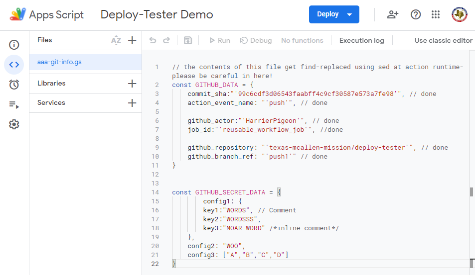

# deploy-tester

Demo repository for our CLASP deployment pipeline that gets code from GitHub to Google AppScript projects.

### [Link to Dev Branch of Demo](https://script.google.com/d/1ENdDRwHHCkaZhoE8mMbjWNmvy5fmFVa5hNBKaIMAbOR3zfpdAkrf2iKo/edit?usp=sharing)

## Things To Setup

Everything you need to hit an MVP deployable-from-github appscript project.

This walkthrough will show you how to set this up.  Keep in mind as you read this that it's super easy to set up multiple workflows for development branches and live releases so that you can have a separate development environment.

Things to do:

1. Copy over the workflow file.
2. Set up repo secrets.
3. Run CI for the first time.
4. Read the supplemental information.

### Copying the CI Workflow file

either make a copy of this repository, or go to the [action's repo](https://github.com/texas-mcallen-mission/deploy-google-app-script-action-typescript) and copy [`reusable-stubby.yml`](https://github.com/texas-mcallen-mission/deploy-google-app-script-action-typescript/blob/main/.github/workflows/reusable-stubby.yml) over to ``.github/workflows/``.

*keep in mind that the branch reference is kinda important- by default you'll get the ``main`` branch, but if you want to stick to a particular version, you can replace ``main`` on line 15 with a valid commit hash, a version number, or a different branch name.*

### Setting Up Actions Secrets

- *to access- go to your repository's Settings / Security / Secrets / Actions.*

#### ``CLASPRC_JSON``

- The contents of ``clasprc.json``.  You get this by setting up and logging into [clasp](https://github.com/google/clasp) on a local machine.  (You will need to install node.js on your machine for this to work, BTW.)  It generally winds up in your home directory.

``REPO_ACCESS_TOKEN``

- [Personal access token](https://github.com/settings/tokens) with ``repo`` access.

#### ``SCRIPT_ID``

The script id- the alphanumeric string after ``projects/``: in this demo's case, the string for this:

[https://script.google.com/u/1/home/projects/1ENdDRwHHCkaZhoE8mMbjWNmvy5fmFVa5hNBKaIMAbOR3zfpdAkrf2iKo/edit](https://script.google.com/u/1/home/projects/1ENdDRwHHCkaZhoE8mMbjWNmvy5fmFVa5hNBKaIMAbOR3zfpdAkrf2iKo/edit)

is ``1ENdDRwHHCkaZhoE8mMbjWNmvy5fmFVa5hNBKaIMAbOR3zfpdAkrf2iKo``

#### ``CONFIG_DATA`` - optional, but recommended

If you want to pass through data (in JSON format) to your project, here's where to send it in.  We use this to store document ID's and stuff that we don't want to publish.  For this demo, we're passing in some fake config data that looks like this:

```js
    config1: {
        key1:"WORDS", // Comment
        key2:"WORDSSS",
        key3:"MOAR WORD" /*inline comment*/
    },
    config2: "WOO",
    config3: ["A","B","C","D"]
```

*This data gets stored inside a JS object.  Anything that legally fits inside of one of those is okay.*

#### ``PARENT_ID`` - optional

If you have a containing document, put the ID for it here.

### Running the CI Workflow

After copying the workflow over and committing it, the actions should immediately start running on commits (for the specified branch) or release publications.

Once you've set up secrets, create an empty commit on your specified branch and push it.  The action should complete.  Go to your AppsScript project and verify that ```aaa-git-info.gs``` exists and looks something like this:



*The config data that we pushed is right there inside of ``GITHUB_SECRET_DATA``.*

At this point, you're done!  All the code you write and push to GitHub should automatically wind up in your Google AppScript project.

### Supplemental Information

If you want to have a separate development and live release version, the easiest way is to have muliple workflows with different specified branches.  You'll also want to add extra actions secrets and tweak the workflow secrets (lines 25+) so that you don't hit the same documents for both.  For a working example of this, see our [key indicator system's repo](https://github.com/texas-mcallen-mission/key-indicator-system) which has at one point or another used three different development branches and a live release.
